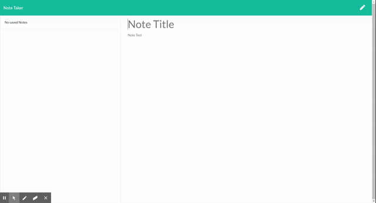

# Note Taker

https://dethrelkeld.github.io/noteTaker/

This is a project to take and store notes with Create, Read, Use and Delete functionality. Enter the name of your note, fill out the body and then click on the floppy disk icon to save it. You can recall and edit the notes by clicking on them or delete them by clicking on the trash can icon.

Technologies used:
- Javascript
- NodeJS
- Express
- JSON

### License
 